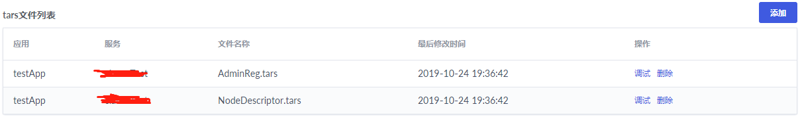
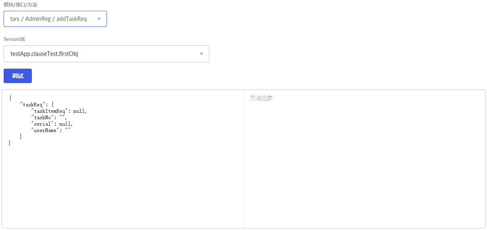
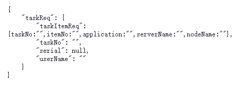

# 接口调试功能使用文档

接口调试功能用于tars服务开发完成后，通过平台传参调试服务的可用性。

## 上传tars文件

点击添加按钮，添加服务的tars文件。如果tars文件有多个（一般分为描述文件和接口文件两个），需要同时上传（按住ctrl键选择多个文件）。

## 调试

只要tars文件没有语法错误，一般都能上传成功。如果出现错误，请到后台日志中查看出错原因。

上传成功后，点击tars接口文件后面的调试链接，进入到调试界面。

选择需要调试的方法，入参框中会自动填入方法的入参。输入相应的值后点击调试即可。入参只解析到一层。如果入参是struct类型，可传入一个对象。

